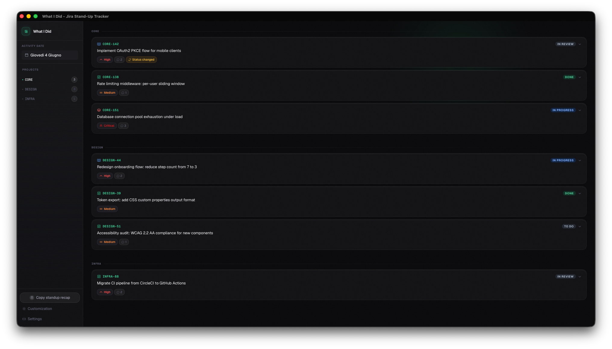

# What I did


> A lightweight desktop app that pulls your Jira activity from the previous working day and turns it into a clean standup summary, ready to paste, no copy-pasting from browser tabs.

<p align="center">
  
</p>

## Why

Every standup I'd blank on what I actually did the day before. And if it was a Friday? Forget it, Monday morning I couldn't remember a thing from the whole week. So I built this: open the app, see everything you touched yesterday, copy the summary, done.

## Features

**Activity feed**
- Fetches all Jira issues you touched yesterday (by you, within the configured time window)
- Groups issues by project with collapsible sections
- Inline rich-text descriptions rendered from Atlassian Document Format (ADF)
- Status changes, comments, attachments, and worklogs shown inside each card
- Image attachments previewed inline, no browser required

**Standup summary**
- One-click **Copy standup summary** generates a ready-to-send bullet list to your clipboard
- Smart window: skips weekends, so Monday shows Friday's activity

**Multiple Jira connections**
- Connect to multiple Jira instances simultaneously (e.g. personal + work)
- Each connection has its own credentials; issues show their source connection
- Partial failures handled gracefully, one broken connection won't hide the rest

**Customization**
- 5 accent color themes: Emerald, Indigo, Rose, Sky, Violet
- Theme applied instantly and persisted across restarts
- Mock mode for offline development / UI exploration

**Privacy & security**
- All credentials stored locally via Tauri's encrypted store, nothing leaves your machine
- No analytics, no telemetry, no cloud sync

## Install

Download the latest release from the [Releases page](../../releases/latest) and pick the file for your platform.

| Platform | File |
|---|---|
| macOS - Apple Silicon (M1 / M2 / M3 / M4) | `what-i-did_x.x.x_aarch64.dmg` |
| macOS - Intel | `what-i-did_x.x.x_x64.dmg` |
| Windows 10 / 11 (installer) | `what-i-did_x.x.x_x64-setup.exe` |
| Windows 10 / 11 (MSI) | `what-i-did_x.x.x_x64_en-US.msi` |
| Linux - Debian / Ubuntu / Mint | `what-i-did_x.x.x_amd64.deb` |
| Linux - Fedora / RHEL / openSUSE | `what-i-did-x.x.x-1.x86_64.rpm` |
| Linux - AppImage (any distro) | `what-i-did_x.x.x_amd64.AppImage` |

### Not sure which Mac you have?

Apple menu -> **About This Mac** -> "Chip" means Apple Silicon, "Processor" means Intel.

### macOS - first launch

macOS may block the app with a "damaged" error because it is not notarized. Two options:

**Option A - Terminal (recommended)**
1. Open the `.dmg` and drag the app to `/Applications`
2. Open **Terminal** (Spotlight -> "Terminal")
3. Run:
   ```bash
   xattr -cr /Applications/what-i-did.app
   ```
4. Open the app normally

**Option B - System Settings**
1. Try to open the app (it will be blocked)
2. Open **System Settings** -> **Privacy & Security**
3. Scroll down -> click **"Open Anyway"**
4. Confirm in the dialog

> Cause: app not notarized with Apple. No malware - just no $99/yr Apple cert.

### Windows - SmartScreen warning

Windows may show a SmartScreen prompt because the app is not code-signed. Click **More info** -> **Run anyway**.

---

## Requirements

- [Bun](https://bun.sh/) >= 1.0
- [Rust](https://rustup.rs/) (stable toolchain)
- [Tauri prerequisites](https://tauri.app/start/prerequisites/) for your OS

## Getting started

```bash
# Install JS dependencies
bun install

# Run in development mode
bun tauri dev

# Build a production binary
bun tauri build
```

## Configuration

On first launch the app opens the **Settings** screen. You can add one or more Jira connections:

| Field | Example |
|-------|---------|
| Name | `Work` |
| Jira Base URL | `https://mycompany.atlassian.net` |
| Email | `you@company.com` |
| Personal Access Token | *(generate at Profile > Security > Create API Token)* |

Multiple connections can be added, edited, or deleted at any time via the settings button.

Accent color and mock mode live in the **Customization** screen (palette icon in the sidebar).

## Tech stack

| Layer | Tech |
|-------|------|
| Desktop shell | Tauri 2 |
| Frontend | React 18 + TypeScript |
| Build tool | Vite 8 |
| Package manager | Bun |
| Styling | Tailwind CSS v4 |
| Icons | Phosphor Icons |
| HTTP | `@tauri-apps/plugin-http` |
| Storage | `@tauri-apps/plugin-store` |
| Clipboard | `@tauri-apps/plugin-clipboard-manager` |

## Architecture

The project follows Clean Architecture with strict layer separation:

```
src/
├── domain/          # Entities and port interfaces (no dependencies)
├── application/     # Use cases (fetchYesterdayActivity, buildStandupSummary)
├── data/
│   ├── jira/        # Jira REST API client, mapper, repository
│   └── mock/        # Offline mock data for development
└── presentation/
    ├── components/  # React UI components
    └── hooks/       # useSourceConfig (config persistence + migration)
```

## License

MIT, see [LICENSE](./LICENSE).
